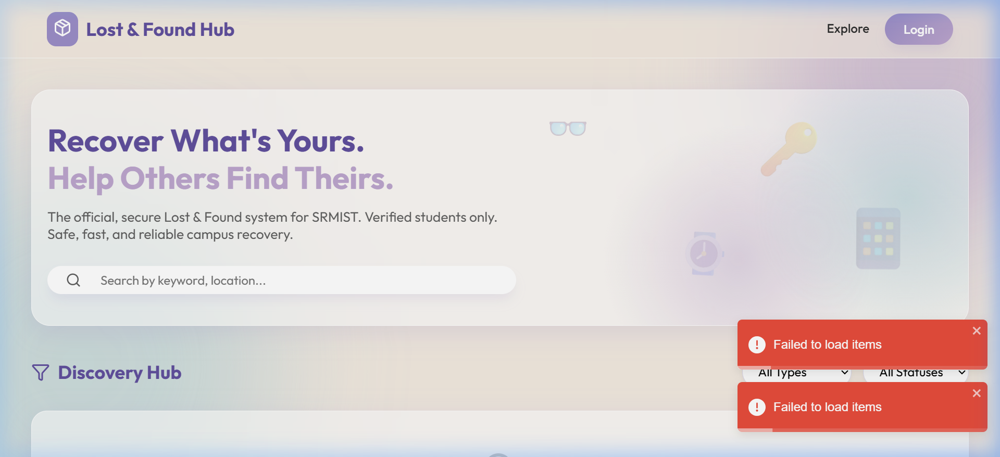
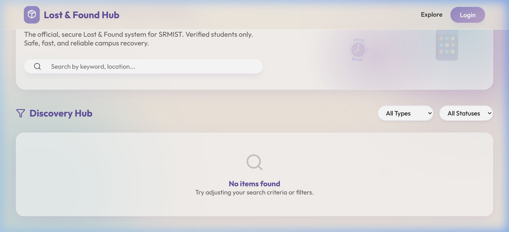
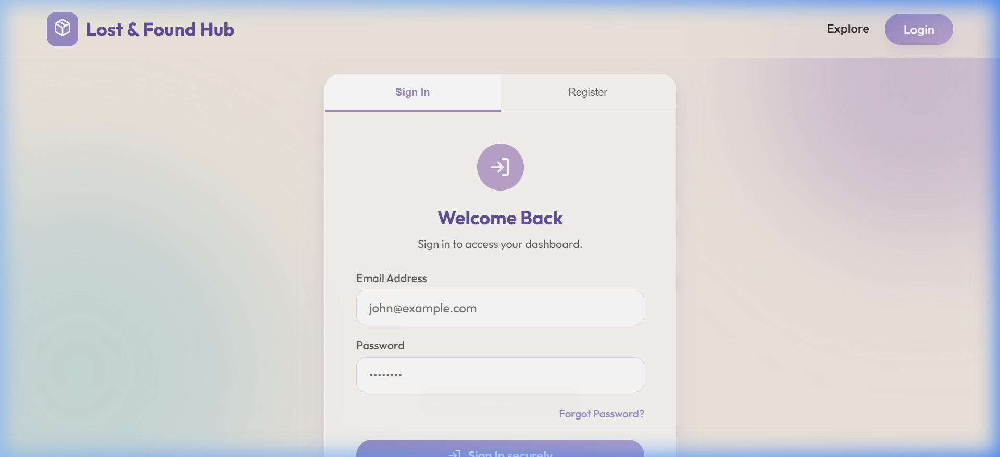

<div align="center">


# 📦 Lost & Found Hub

**The official, secure Lost & Found system for SRMIST.**  
_Recover What's Yours. Help Others Find Theirs._

[🌐 Live Demo](https://your-deployment-url.vercel.app) · [🐛 Report Bug](https://github.com/your-username/lost-and-found-hub/issues) · [💡 Request Feature](https://github.com/your-username/lost-and-found-hub/issues)

</div>

---

## 🖼️ Screenshots

### 🏠 Home Page – Hero & Search



### 🔍 Discovery Hub – Browse Items



### 🔐 Login & Register



---

## 📖 About

**Lost & Found Hub** is a full-stack web application built for the SRMIST campus community. It provides a secure, centralized platform where verified students can post lost items, report found items, claim ownership, and communicate in real time — all within a safe and moderated environment.

---

## ✨ Features

### 🔑 Authentication & Security
- **Email + Password** registration with OTP-based verification
- **Google OAuth 2.0** login via `@srmist.edu.in` or `@gmail.com` accounts
- **JWT-based** protected routes (access & dashboard)
- **Rate limiting** – 100 requests per 15 minutes per IP
- **bcrypt** password hashing

### 📋 Item Management
- Post **Lost** or **Found** items with name, description, location, date & image
- Upload item photos (stored via **Multer**)
- Edit or delete your own posts from the Dashboard
- Item status tracking: `Lost` → `Found` → `Returned`

### 📥 Claims System
- Any user can **claim** a found item with a message
- Item owner receives an **automated email notification** (Nodemailer)
- Owner can **Accept** or **Reject** claims directly from the Dashboard

### 💬 Real-Time Chat (Inbox)
- **Socket.IO** powered live messaging between item poster and claimants
- Persistent chat history stored in MongoDB
- "Detective's Desk" empty state UI

### 🛡️ Content Moderation
- **Automated profanity filtering** using `bad-words`
- **Community reporting** – users can flag inappropriate posts
- Items with multiple reports are automatically hidden

### 🔍 Search & Filter
- Search items by **keyword or location**
- Filter by **type** (Lost/Found) and **status**
- Real-time results without page reload

---

## 🛠️ Tech Stack

| Layer | Technology |
|---|---|
| **Frontend** | React 18, Vite, React Router v6 |
| **Styling** | Vanilla CSS with glassmorphism & gradients |
| **State** | React Context API |
| **Backend** | Node.js, Express 5 |
| **Database** | MongoDB Atlas + Mongoose |
| **Auth** | JWT, bcryptjs, Google OAuth 2.0 |
| **Real-Time** | Socket.IO |
| **Email** | Nodemailer |
| **File Upload** | Multer |
| **Security** | express-rate-limit, bad-words |
| **Notifications** | react-toastify |

---

## 📁 Project Structure

```
LostAndFoundHub_Project/
├── backend/
│   ├── middleware/
│   │   ├── auth.js          # JWT verification middleware
│   │   └── upload.js        # Multer file upload config
│   ├── models/
│   │   ├── User.js          # User schema (email, password, googleId)
│   │   ├── Item.js          # Item schema (type, claims, reports)
│   │   └── Chat.js          # Chat message schema
│   ├── routes/
│   │   ├── auth.js          # /api/auth — register, login, OTP, Google
│   │   ├── items.js         # /api/items — CRUD, claims, reports
│   │   └── chat.js          # /api/chat — message history
│   ├── utils/
│   │   └── mailer.js        # Nodemailer email helper
│   ├── uploads/             # Uploaded item images
│   └── server.js            # Express app + Socket.IO server
│
└── frontend/
    ├── src/
    │   ├── components/
    │   │   ├── Navbar.jsx
    │   │   ├── ItemCard.jsx
    │   │   └── PrivateRoute.jsx
    │   ├── context/
    │   │   └── AuthContext.jsx
    │   ├── pages/
    │   │   ├── Home.jsx         # Browse & search all items
    │   │   ├── Login.jsx        # Sign In / Register with Google
    │   │   ├── Dashboard.jsx    # Manage your posts & claims
    │   │   ├── CreateItem.jsx   # Post lost/found item
    │   │   ├── ItemDetails.jsx  # View item + claim button
    │   │   └── Inbox.jsx        # Real-time chat
    │   ├── utils/
    │   │   └── api.js           # Axios instance with auth interceptor
    │   ├── App.jsx
    │   ├── index.css
    │   └── main.jsx
    └── index.html
```

---

## 🚀 Getting Started

### Prerequisites

- [Node.js](https://nodejs.org/) v18+
- [MongoDB Atlas](https://www.mongodb.com/cloud/atlas) account (or local MongoDB)
- [Google Cloud Console](https://console.cloud.google.com/) project with OAuth 2.0 credentials
- A Gmail account for Nodemailer (or any SMTP provider)

---

### ⚙️ Backend Setup

1. **Navigate to the backend directory:**
   ```bash
   cd backend
   npm install
   ```

2. **Create a `.env` file** in the `backend/` folder:
   ```env
   PORT=5000
   MONGO_URI=mongodb+srv://<username>:<password>@cluster.mongodb.net/lostandfoundhub
   JWT_SECRET=your_super_secret_jwt_key
   GOOGLE_CLIENT_ID=your_google_client_id.apps.googleusercontent.com
   EMAIL_USER=your_email@gmail.com
   EMAIL_PASS=your_gmail_app_password
   ```

3. **Start the backend server:**
   ```bash
   node server.js
   ```
   The server runs on `http://localhost:5000`

---

### 🎨 Frontend Setup

1. **Navigate to the frontend directory:**
   ```bash
   cd frontend
   npm install
   ```

2. **Create a `.env` file** in the `frontend/` folder:
   ```env
   VITE_API_URL=http://localhost:5000/api
   VITE_GOOGLE_CLIENT_ID=your_google_client_id.apps.googleusercontent.com
   ```

3. **Start the development server:**
   ```bash
   npm run dev
   ```
   The app runs on `http://localhost:5173`

---

## 🔌 API Reference

### Auth Routes — `/api/auth`

| Method | Endpoint | Description | Auth |
|--------|----------|-------------|------|
| `POST` | `/register` | Register with email + password | ❌ |
| `POST` | `/verify-otp` | Verify email OTP | ❌ |
| `POST` | `/login` | Login with email + password | ❌ |
| `POST` | `/google` | Google OAuth login | ❌ |
| `GET` | `/me` | Get current user profile | ✅ |

### Items Routes — `/api/items`

| Method | Endpoint | Description | Auth |
|--------|----------|-------------|------|
| `GET` | `/` | Get all items (with filters) | ❌ |
| `POST` | `/` | Create a new item | ✅ |
| `GET` | `/:id` | Get item by ID | ❌ |
| `PUT` | `/:id` | Update item | ✅ |
| `DELETE` | `/:id` | Delete item | ✅ |
| `POST` | `/:id/claim` | Submit a claim | ✅ |
| `PUT` | `/:id/claims/:claimId` | Accept/Reject a claim | ✅ |
| `POST` | `/:id/report` | Report an item | ✅ |

### Chat Routes — `/api/chat`

| Method | Endpoint | Description | Auth |
|--------|----------|-------------|------|
| `GET` | `/:chatId` | Get chat history | ✅ |
| `POST` | `/` | Save a message | ✅ |

---

## ☁️ Deployment

### Backend → [Render](https://render.com/)
- Set **Root Directory** to `backend`
- Set **Build Command** to `npm install`
- Set **Start Command** to `node server.js`
- Add all `.env` variables in the Render Environment tab

### Frontend → [Vercel](https://vercel.com/)
- Set **Root Directory** to `frontend`
- Add `VITE_API_URL=https://your-render-backend.onrender.com/api`
- Add `VITE_GOOGLE_CLIENT_ID=your_google_client_id`

> **Note:** Update your Google OAuth Authorized Origins in Google Cloud Console to include your Vercel domain.

---

## 🤝 Contributing

Pull requests are welcome! For major changes, please open an issue first.

1. Fork the repository
2. Create your feature branch (`git checkout -b feature/AmazingFeature`)
3. Commit your changes (`git commit -m 'Add AmazingFeature'`)
4. Push to the branch (`git push origin feature/AmazingFeature`)
5. Open a Pull Request

---

## 📜 License

This project is licensed under the **ISC License**.

---

<div align="center">
Made with ❤️ for SRMIST by the Lost & Found Hub Team
</div>
